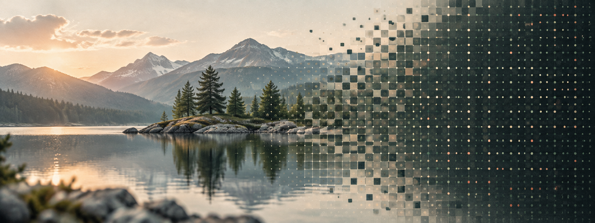
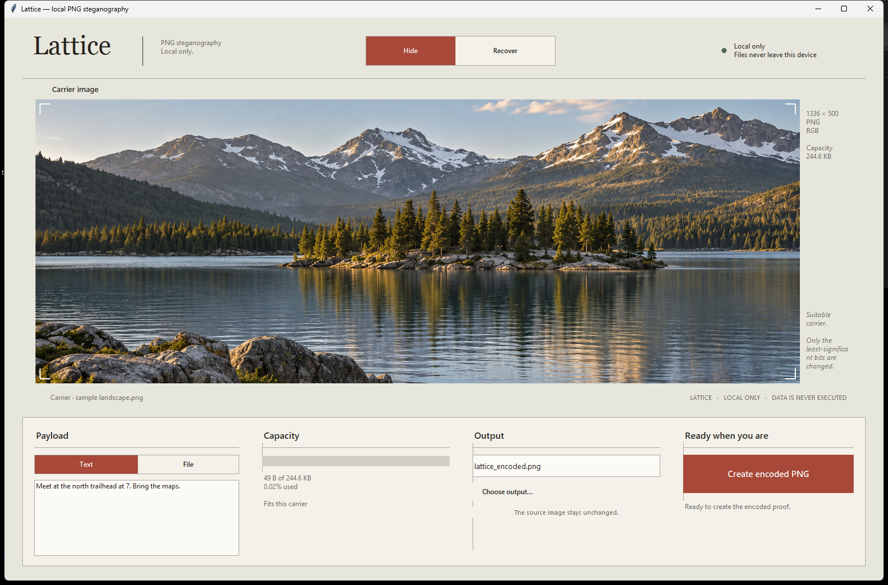
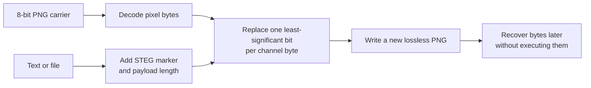

<div align="center">

# Lattice

### Hide data in plain sight.

A local, dependency-free PNG steganography workbench for embedding and recovering text or files.

[](https://www.python.org/)




</div>

Lattice changes only the least-significant bits of a lossless PNG's pixel data. The image still looks like the image; the payload stays underneath, ready to be recovered by Lattice.

> [!IMPORTANT]
> Lattice embeds and extracts bytes—it does **not** execute recovered content or turn an image into an executable. Steganography is also not encryption; encrypt sensitive data before embedding it.

## The workbench



The desktop interface keeps the whole workflow visible: choose a carrier, add text or a file, check whether it fits, and create a new encoded PNG. Switch to **Recover** to inspect a compatible image and save the hidden bytes safely.

## Highlights

- **Local by design** — files never leave your machine.
- **Two ways to work** — a polished Tkinter desktop app and a scriptable CLI.
- **Text or any file** — payloads are handled as raw bytes.
- **Capacity feedback** — know whether a payload fits before writing anything.
- **Source-safe output** — the desktop app requires a new output path.
- **Zero package installs** — the PNG codec and steganography pipeline use only Python's standard library.

## Quick start

You need **Python 3.10 or newer** with Tkinter available.

```bash
python app.py
```

On Windows, you can also double-click `lattice.bat`.

Want to open the interface with the included landscape and example message already loaded?

```bash
python app.py --demo
```

### Keyboard shortcuts

| Shortcut | Action |
| --- | --- |
| `Alt+H` | Switch to Hide |
| `Alt+R` | Switch to Recover |
| `Ctrl+O` | Choose a carrier or encoded PNG |
| `Ctrl+Enter` | Run the current action |

## Command line

Hide a message:

```bash
python steg.py encode carrier.png "Meet at the north trailhead." -o encoded.png
```

Hide a file:

```bash
python steg.py encode carrier.png --file notes.pdf -o encoded.png
```

Recover readable text in the terminal:

```bash
python steg.py decode encoded.png
```

Recover any payload to a file:

```bash
python steg.py decode encoded.png -o recovered.bin
```

## How it works



Every payload is prefixed with the four-byte marker `STEG` and a four-byte big-endian payload length. The resulting bitstream is written one bit at a time into the lowest bit of each available channel byte.

Approximate payload capacity:

```text
(width × height × channels ÷ 8) − 8 bytes
```

For example, a 1920 × 1080 RGB image can hold roughly **759 KiB**. Alpha channels also contribute capacity when present.

## PNG support

| PNG format | Supported |
| --- | :---: |
| 8-bit grayscale | Yes |
| 8-bit RGB | Yes |
| 8-bit grayscale + alpha | Yes |
| 8-bit RGBA | Yes |
| Paletted/indexed color | No |
| 16-bit channels | No |

Lattice always writes a lossless PNG. Converting the encoded file to JPEG, resizing it, optimizing its pixels, or editing and re-saving it can destroy the hidden payload.

## Project map

```text
.
├── app.py                  # Tkinter desktop interface
├── steg.py                 # PNG codec, LSB engine, and CLI
├── lattice.bat             # Double-click launcher for Windows
├── assets/plates/          # Built-in carrier and preview images
├── docs/assets/            # README artwork and product screenshot
├── sample.png              # Small carrier fixture
└── hidden.png              # Small encoded fixture
```

## Design boundaries

Lattice is intentionally small and transparent:

- no uploads, network calls, telemetry, or third-party Python packages;
- no encryption, compression, password protection, or integrity authentication;
- no execution, opening, or automatic dispatch of recovered payloads;
- no resilience against lossy conversion or pixel-level image modification.

Use it for learning, local experiments, watermark-like metadata, and other lawful workflows where both sides know how to recover the payload.

---

<div align="center">
  <sub>One image on the surface. A few more bits underneath.</sub>
</div>
