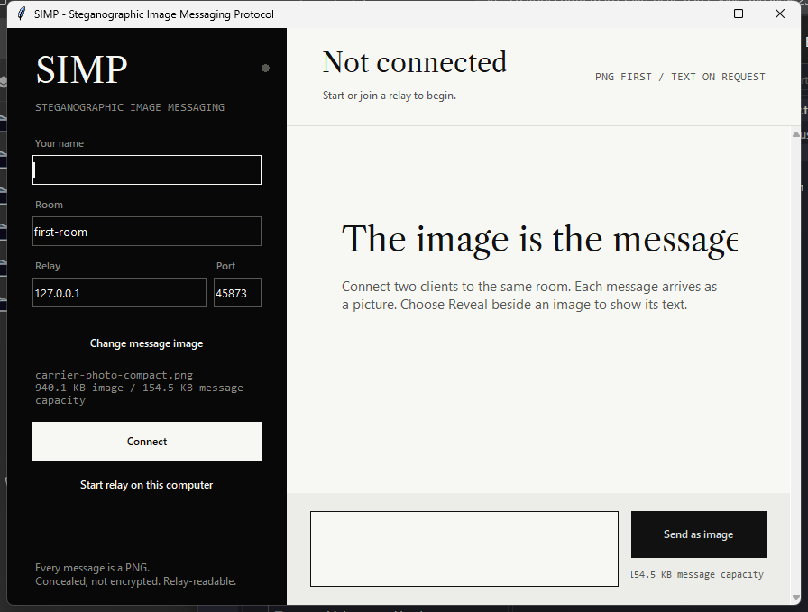
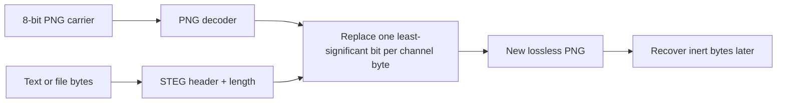

<div align="center">

# SIMP

### Steganographic Image Messaging Protocol

A dependency-free, multi-client messaging protocol where every application
event travels inside a steganographic PNG.




</div>

SIMP hides text or file data in the least-significant bits of an 8-bit PNG.
The resulting carrier remains a valid, visually similar PNG that SIMP can later
decode. Its messenger uses those encoded images as the application protocol:
every join, message, and leave event travels as a PNG.

> [!IMPORTANT]
> SIMP embeds and extracts inert bytes. It never executes recovered content and
> does not turn an image into an executable. Steganography conceals data but does
> not encrypt it; encrypt sensitive data before embedding it.

## Features

- Image-first chat client with isolated rooms, on-request text reveal, and a lightweight relay.
- Two-client setup by default, with multi-client rooms supported by the same protocol.
- Optional local utility for manually hiding and recovering text or files.
- Standard-library PNG codec and least-significant-bit embedding engine.
- Capacity validation before data is written.
- Versioned `SIMP/1` message envelopes with legacy `LATTICE-WIRE/1` decoding.
- No telemetry, uploads, third-party runtime packages, or automatic execution.

## Quick start

Requirements: Python 3.10 or newer with Tkinter.

Launch the messenger:

```bash
python -m simp
```

On Windows, double-click `simp.bat`. `simp-messenger.bat` is an equivalent
explicit launcher.

The manual Hide/Recover utility is separate from the messaging app:

```bash
python -m simp workbench
```

## Messenger setup

1. Open the messenger and enter a display name and room.
2. Enable **Start relay on this computer**, then select **Connect**.
3. Open another messenger instance.
4. Connect with a different name, the same room, and the same relay address.
5. Type a message and select **Send as image**.
6. Messages appear as PNG previews; select **Reveal** beside one to show its text.

For clients on different computers, run a relay on a reachable host:

```bash
python -m simp relay --host 0.0.0.0 --port 45873
```

Then use that host's LAN address and port in each client. Do not expose this
learning prototype directly to the public internet: it intentionally has no
encryption, identity authentication, persistent history, or production-grade
abuse protection.

For an Oracle Linux or Ubuntu VM, use the hardened `systemd` template and setup
notes in [`docs/oracle-server.md`](docs/oracle-server.md). The relay stores no
message history; envelopes expire after 24 hours and lifetimes are capped at
seven days.

## Codec CLI

Hide and recover text:

```bash
python -m simp codec encode examples/sample.png "Meet at the north trailhead." -o encoded.png
python -m simp codec decode encoded.png
```

Hide and recover a file:

```bash
python -m simp codec encode carrier.png --file notes.pdf -o encoded.png
python -m simp codec decode encoded.png -o recovered.bin
```

## How it works



The base codec prefixes each payload with a four-byte `STEG` marker and a
four-byte big-endian length. Messenger payloads add a `SIMP/1` envelope
containing the protocol version, event kind, UUID, sender, room, timestamps,
and message text. New envelopes expire after 24 hours. TCP adds only a
four-byte frame length around each PNG.

Approximate capacity is:

```text
(width x height x channels / 8) - 8 bytes
```

Supported inputs are 8-bit grayscale, RGB, grayscale-alpha, and RGBA PNGs.
Paletted and 16-bit PNGs are not supported. JPEG conversion, resizing,
optimization, or pixel editing can destroy embedded data.

The PNG reader validates chunk boundaries and CRCs, rejects unknown scanline
filters, and caps input at 64 MB and decoded pixel data at 48 MB.

## Project structure

```text
.
|-- simp/                       Python package
|   |-- app.py                  Primary messenger entry point
|   |-- chat.py                 Image messenger UI
|   |-- workbench.py            Optional Hide/Recover utility
|   |-- steg.py                 PNG codec, LSB engine, and codec CLI
|   |-- wire_protocol.py        Versioned message envelope
|   |-- wire_client.py          Reusable connected client
|   |-- transport.py            Length-framed PNG transport
|   |-- relay.py                Multi-room relay server
|   `-- assets/                 Fonts and bundled carrier images
|-- tests/                      Unit and integration tests
|-- examples/                   Sample and encoded PNG fixtures
|-- docs/                       Product, design, and server setup
|-- deploy/                     Hardened systemd relay service
|-- archive/legacy-prototype/   Inactive historical material
|-- pyproject.toml              Package metadata and console scripts
|-- simp.bat                    Windows messenger launcher
`-- simp-messenger.bat          Windows messenger launcher
```

The archived prototype is not part of the package and is never imported by the
supported application. Its former script and launcher files have an added
`.txt` suffix so they cannot be launched accidentally.

## Development

Run the test suite from the repository root:

```bash
python -m unittest discover -s tests -v
```

The tests cover byte-level steganography, malformed-PNG rejection, envelope
validation, legacy compatibility, socket framing, room isolation, relay control
frame rejection, and byte-identical delivery across two- and three-client rooms.

For editable command-line entry points, install the project locally:

```bash
python -m pip install -e .
simp --help
```

## Security boundaries

- Recovered data is returned or saved; it is never opened or executed.
- The local workbench makes no network calls.
- The messenger contacts only the relay address entered by the user.
- The relay limits participants, room size, message rate, handshake time, and
  idle connection time; clients cannot send relay-only control frames or
  expired envelopes.
- SIMP provides concealment, not confidentiality, authenticity, or integrity.
- Treat decoded files with the same caution as any untrusted downloaded file.
