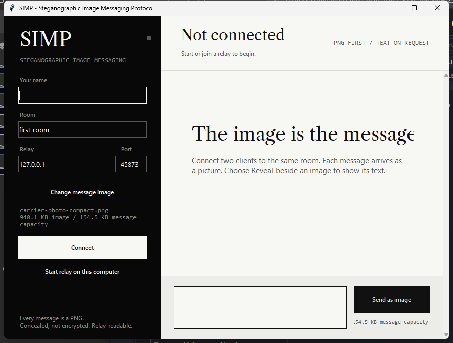
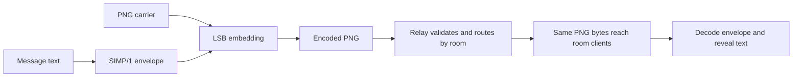

<div align="center">

# SIMP

**Steganographic Image Messaging Protocol**

### The image is the message.

Exchange text through PNG images. Reveal the words when you're ready.


**[Quick start](#quick-start)** · **[Try a conversation](#try-a-conversation)** · **[Hide and recover data](#hide-and-recover-data)** · **[Protocol](#how-it-works)** · **[Server setup](docs/oracle-server.md)**



<sub>Python + Tkinter desktop messenger · PNG previews · Text revealed on request</sub>

</div>

SIMP is a standard-library Python messenger that hides each application event in
the least-significant bits of a PNG. Join requests, messages, leave events, and
relay responses all travel as images. Participants in the same room receive the
same message PNG bytes and can reveal the text beside the image that carried it.

It also includes a local **Hide/Recover workbench** and a **codec CLI** for
embedding UTF-8 text or arbitrary file bytes in your own PNGs.

> [!IMPORTANT]
> **Concealed does not mean encrypted.** SIMP is a learning prototype with no
> encryption or identity authentication. The relay decodes envelopes to validate
> and route them, so it can read messages. Recovered data is never executed.

## What you can do

| Capability | What it gives you |
| --- | --- |
| **Chat through images** | Send text as a valid PNG, then select **Reveal** to read it. |
| **Share a room** | Connect two or more clients with distinct display names; rooms are isolated. |
| **Choose your carrier** | Use the bundled photograph or select a compatible PNG; capacity is checked before sending. |
| **Run your own relay** | Start one inside the desktop app or launch a standalone TCP server. |
| **Inspect hidden data** | Hide and recover text or files with the separate workbench or CLI. |
| **Attach context** | See local send timestamps and optionally include an approximate area label. |

The application has no third-party runtime dependencies or telemetry. The
workbench processes files locally. The messenger uses your chosen relay and,
only when enabled, an external approximate-location lookup.

## Quick start

You need **Python 3.10+**. The desktop interfaces also require **Tkinter**;
the relay and codec CLI can run without a graphical desktop.

```bash
git clone https://github.com/davidrencse/SIMP.git
cd SIMP
python -m simp
```

On Windows, you can also double-click [`simp.bat`](simp.bat) or
[`simp-messenger.bat`](simp-messenger.bat) from the repository folder.

To check whether Tkinter is available, run `python -m tkinter`; a small demo
window should open. If it is missing, install Tk support for your Python
distribution before launching the desktop app.

<details>
<summary><strong>Optional: install command-line entry points</strong></summary>

From the repository root:

```bash
python -m pip install -e .
simp --help
```

This adds `simp`, `simp-messenger`, `simp-workbench`, and `simp-relay` commands.
Running directly with `python -m simp` does not require this installation step.

</details>

## Try a conversation

Start with two messenger windows on one computer. The defaults are relay
`127.0.0.1`, port `45873`, and room `first-room`.

1. Run `python -m simp` and enter **Alice** as your name.
2. Select **Start relay on this computer**, wait for it to start, then select **Connect**.
3. Run `python -m simp` again in another terminal and enter **Bob**.
4. Keep the same room, relay, and port in Bob's window, then select **Connect**.
5. Type a message in either window and select **Send as image**.
6. Select **Reveal** beside the received PNG to read its text.

Keep Alice's window open while using its built-in relay. Add more clients with
different names to try a group conversation, or change the room to start a
separate conversation. **Change message image** lets you select another carrier.

| Shortcut | Action |
| --- | --- |
| `Ctrl+K` | Connect or disconnect |
| `Ctrl+O` | Choose a PNG carrier |
| `Ctrl+Enter` | Send the message as an image |
| `Alt+S` | Focus live status |

### Connect across computers

Run a standalone relay on a trusted, reachable host:

```bash
python -m simp relay --host 0.0.0.0 --port 45873
```

Enter that computer's reachable LAN address in each client's **Relay** field,
use port `45873`, and choose the same room. `0.0.0.0` is the server's bind address;
clients must use its actual address. Allow inbound TCP on that port as needed.

For a remote VM, follow the [Oracle Linux / Ubuntu server guide](docs/oracle-server.md)
and use the bundled [systemd service](deploy/simp-relay.service). Keep access
restricted to trusted clients or a private VPN; this prototype is unsuitable
for unrestricted public-internet exposure.

### Optional approximate location

Select **Include approximate location** and wait for the area label before
sending. The option is off by default. It sends an HTTPS request to
[ipapi.co](https://ipapi.co/api/), which sees your public IP and estimates your
city, region, and country. Only the resulting place label is embedded in the
message PNG; your IP address and precise coordinates are not included.

If the lookup fails, the option switches off and you can still send the message.

## Hide and recover data

For a graphical, local workflow:

```bash
python -m simp workbench
```

Choose a carrier, inspect its capacity, and hide text or a file in a new PNG.
Use **Recover** to extract the bytes later. The workbench makes no network calls.

### Text from the command line

The repository includes a sample carrier you can use immediately:

```bash
python -m simp codec encode examples/sample.png "Meet at the north trailhead." -o encoded.png
python -m simp codec decode encoded.png
```

The decoded output is `Meet at the north trailhead.`

### Files from the command line

Replace `carrier.png` and `notes.pdf` with your own compatible image and file:

```bash
python -m simp codec encode carrier.png --file notes.pdf -o encoded.png
python -m simp codec decode encoded.png -o recovered.bin
```

Recovered files contain the embedded bytes; SIMP never opens or executes them.
The complete file must fit inside the carrier's capacity.

## How it works


```mermaid
flowchart LR
    A[Message text] --> B[SIMP/1 envelope]
    C[PNG carrier] --> D[LSB embedding]
    B --> D
    D --> E[Encoded PNG]
    E --> F[Relay validates and routes by room]
    F --> G[Same PNG bytes reach room clients]
    G --> H[Decode envelope and reveal text]
```

The codec replaces one least-significant bit per image channel byte. Its payload
starts with a four-byte `STEG` marker and a four-byte big-endian byte length.
The result remains a lossless PNG with visually similar pixels.

Messaging adds a `SIMP/1` prefix and a UTF-8 JSON envelope containing the version,
event kind, UUID, sender, room, send time, expiry, text, and optional location.
The decoder also accepts legacy `LATTICE-WIRE/1` payloads.
TCP frames each PNG with a four-byte, network-order length prefix.

### Carrier capacity

```text
payload capacity = floor(width × height × channels / 8) − 8 bytes
```

For example, a 512 × 512 RGB image holds **98,296 payload bytes**. Messenger
envelope metadata uses some of that space; message text has its own 16 KiB limit.

| PNG input | Supported |
| --- | --- |
| 8-bit grayscale, RGB, grayscale-alpha, RGBA | Yes |
| Paletted, 16-bit, or interlaced PNG | No |

Preserve the encoded image's pixels. JPEG conversion, resizing, pixel editing,
or an optimizer that changes pixel values can destroy the hidden payload.

<details>
<summary><strong>Protocol and resource limits</strong></summary>

| Boundary | Limit or behavior |
| --- | --- |
| Display names and rooms | 1–32 ASCII characters; begin with a letter or number, then letters, numbers, spaces, dots, dashes, or underscores |
| Message text | At most 16 KiB of UTF-8 text; the full envelope must also fit in the carrier |
| Message lifetime | 24 hours by default; at most seven days; expired envelopes are rejected by the relay |
| PNG transport frame | At most 32 MiB; must begin with the PNG signature |
| PNG codec input | At most 64 MiB; decoded scanline data is capped at 48 MiB |
| Relay participation | 64 live connections, at most 32 participants per room |
| Incoming rate | At most 30 frames per 10 seconds per client |
| Client history | At most 100 rendered records in the running client |
| Server history | No message database or persistent chat history |

The PNG reader validates chunk boundaries, CRCs, dimensions, and scanline
filters. The relay also limits handshake and idle time, rejects duplicate
display names within a room, and refuses client-forged relay control frames.

Expiry controls acceptance of an envelope; it does not erase copies of PNGs
already received or saved.

</details>

## Privacy and security

- **No confidentiality or authenticated identity.** Steganography conceals bytes;
  it does not provide encryption, authenticity, or cryptographic integrity.
- **Relay-readable messages.** The server extracts envelopes before routing them.
- **Explicit network access.** The messenger connects to your chosen relay;
  approximate location adds an opt-in request to ipapi.co.
- **Local file processing.** The workbench embeds and recovers bytes on your
  computer without uploading them.
- **Inert recovered data.** Extraction returns or saves bytes. Treat decoded
  files with the same caution as other untrusted files.

For sensitive file payloads, encrypt them before embedding. Keep messenger
experiments on trusted networks or behind a private VPN.

## Development

Run the existing unit and integration suite from the repository root:

```bash
python -m unittest discover -s tests -v
```

It covers steganography round trips, malformed PNGs, envelope validation and
expiry, optional location, legacy compatibility, TCP framing, room isolation,
control-frame rejection, and byte-identical delivery to two- and three-client rooms.

<details>
<summary><strong>Repository map</strong></summary>

```text
simp/
├── app.py                 Primary messenger entry point
├── chat.py                Tkinter conversation interface
├── workbench.py           Local Hide/Recover interface
├── steg.py                PNG codec, LSB engine, and codec CLI
├── wire_protocol.py       Versioned envelopes and image encoding
├── wire_client.py         Reusable connected client
├── transport.py           Length-framed PNG socket transport
├── relay.py               Multi-room relay server
├── location.py            Opt-in approximate area lookup
└── assets/                Bundled fonts and carrier images
tests/                     Unit and integration tests
examples/                  Sample and encoded PNG fixtures
docs/                      Product, design, and deployment notes
deploy/                    systemd relay service
archive/legacy-prototype/  Inactive historical material
pyproject.toml             Package metadata and console scripts
```

The archived prototype is excluded from the supported package and is never
imported by the application. Former scripts and launchers have a `.txt` suffix.

</details>

Bug reports and focused pull requests are welcome through
[GitHub issues](https://github.com/davidrencse/SIMP/issues) and
[pull requests](https://github.com/davidrencse/SIMP/pulls). Include reproduction
steps for bugs and run the test suite when changing the codec or protocol.

## Documentation and credits

- [Product and protocol boundaries](docs/product.md)
- [Desktop design system](docs/design-system.md)
- [Oracle Linux / Ubuntu relay deployment](docs/oracle-server.md)
- [Libre Caslon Text font license](simp/assets/fonts/OFL-Libre-Caslon-Text.txt)
- README layout informed by [Awesome GitHub README Tools](https://github.com/gacoon/awesome-github-readme-tools), using a compact badge row, quick links, a visual preview, and runnable examples.

<div align="center">

**Every message is a PNG.**

[Back to top](#simp)

</div>
